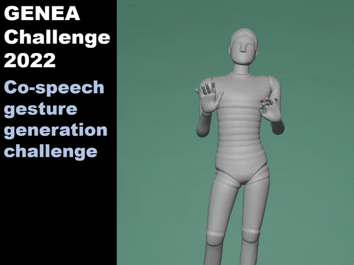

<meta content="The GENEA Challenge 2022" property="og:title">
<meta content="A large evaluation of data-driven co-speech gesture generation" property="og:description">

### [Youngwoo Yoon\*](https://sites.google.com/view/youngwoo-yoon/), [Pieter Wolfert\*](https://www.pieterwolfert.com/), [Taras Kucherenko\*](https://svito-zar.github.io/), [Carla Viegas](https://carlaviegas.info/), [Teodor Nikolov](https://teonikolov.com/), [Mihail Tsakov](https://www.linkedin.com/in/mihailtsakov/), [Gustav Eje Henter](https://people.kth.se/~ghe/)

### [[Challenge Paper (ICMI’22)]](https://arxiv.org/pdf/2208.10441.pdf)

<br/>
<p align="center">
  
</p>


## Summary

This webpage contains data, code, and results from the second GENEA Challenge, intended as a benchmark of data-driven automatic co-speech gesture generation. In the challenge, participating teams used a common speech and motion dataset to build gesture-generation systems. Motion generated by all these systems was then rendered to video using a standardised visualisation and evaluated in several large, crowdsourced user studies. [This year's dataset](https://doi.org/10.5281/zenodo.6998230) was based on 18 hours of full-body motion capture, including fingers, of different persons engaging in dyadic conversation, taken from [the Talking With Hands 16.2M dataset](https://github.com/facebookresearch/TalkingWithHands32M/). Ten teams participated in the evaluation across two tiers: full-body and upper-body gesticulation. For each tier we evaluated both the human-likeness of the gesture motion and its appropriateness for the specific speech.

The evaluation results are a revolution, and a revelation: Some synthetic conditions are rated as significantly more human-like than human motion capture. At the same time, all synthetic motion is found to be vastly less appropriate for the speech than the original motion-capture recordings.

Please see [our paper](https://arxiv.org/pdf/2208.10441.pdf) for more information, the challenge introduction video below, and the links below for the challenge data, code, and results.




## Open-source materials

* Data
  * Challenge dataset: [DOI 10.5281/zenodo.6998230](https://doi.org/10.5281/zenodo.6998230)
  * 3D coordinates of submitted motion: [DOI 10.5281/zenodo.6973296](https://doi.org/10.5281/zenodo.6973296)
  * Submitted BVH files: [DOI 10.5281/zenodo.6976463](https://doi.org/10.5281/zenodo.6976463)
  * User-study video stimuli: [DOI 10.5281/zenodo.6997925](https://doi.org/10.5281/zenodo.6997925)
  * Annotation manual: if you need this - contact us
* Code
  * Visualization code: [github.com/TeoNikolov/genea_visualizer](https://github.com/TeoNikolov/genea_visualizer)
  * Objective evaluation code: [github.com/genea-workshop/genea_numerical_evaluations](https://github.com/genea-workshop/genea_numerical_evaluations)
  * Text-based baseline: [Yoon et al. (ICRA 2019)](https://github.com/youngwoo-yoon/Co-Speech_Gesture_Generation)
  * Audio-based baseline: [Kucherenko et al. (IVA 2019)](https://github.com/genea-workshop/Speech_driven_gesture_generation_with_autoencoder/tree/GENEA_2022)
  * Interface for subjective evaluations: [HEMVIP](https://github.com/jonepatr/hemvip/tree/genea2022)
  * Code for creating attention-check videos: [create_attention_check](https://github.com/youngwoo-yoon/create_attention_check)
  * Utility to trim BVH files: [trim_bvh](https://github.com/ghenter/trim_bvh)
  * Modified [PyMO](https://omid.al/projects/pymo/) for the challenge dataset: [Modified PyMO](https://github.com/youngwoo-yoon/PyMO)
* Results
  * Subjective evaluation responses, analysis, and results: [DOI 10.5281/zenodo.6939888](https://doi.org/10.5281/zenodo.6939888)
  * Scripts to run Barnard’s test: [genea-appropriateness](https://github.com/pieterwolfert/genea-appropriateness)
  * Objective evaluation data: [DOI 10.5281/zenodo.6979990](https://doi.org/10.5281/zenodo.6979990) (FGD metric will be included later)
* Papers
  * The GENEA Challenge 2022: A large evaluation of data-driven co-speech gesture generation [[arXiv]](https://arxiv.org/pdf/2208.10441)
  * Exemplar-based Stylized Gesture Generation from Speech: An Entry to the GENEA Challenge 2022 [[OpenReview]](https://openreview.net/pdf?id=fO_Q4q1dFAA)
  * TransGesture: Autoregressive Gesture Generation with RNN-Transducer [[OpenReview]](https://openreview.net/pdf?id=AYMDEx97qPN)
  * The IVI Lab entry to the GENEA Challenge 2022 -- A Tacotron2 Based Method for Co-Speech Gesture Generation With Locality-Constraint Attention Mechanism [[OpenReview]](https://openreview.net/pdf?id=gMTaia--AB2)
  * Hybrid Seq2Seq Architecture for 3D Co-Speech Gesture Generation [[OpenReview]](https://openreview.net/pdf?id=-2HZD-e6pX7W)
  * The DeepMotion entry to the GENEA Challenge 2022 [[OpenReview]](https://openreview.net/pdf?id=zEqdFwAPhhO)
  * The ReprGesture entry to the GENEA Challenge 2022 [[OpenReview]](https://openreview.net/pdf?id=atWaELmguNj7)
  * UEA Digital Humans entry to the GENEA Challenge 2022 [[OpenReview]](https://openreview.net/pdf?id=RZP6nErM2Xa)
  * GestureMaster: Graph-based Speech-driven Gesture Generation [[OpenReview]](https://openreview.net/pdf?id=PHadbLGjHRL)
  * ReCell: replicating recurrent cell for auto-regressive pose generation [[OpenReview]](https://openreview.net/pdf?id=uX86IlhiHNx)
* Presentation videos
  * A short summary of the GENEA Challenge 2022 [[Youtube]](https://youtu.be/4n02wXGGnd0)

## Citation

If you use materials from this challenge, please cite our latest paper about the challenge. Currently, that is our paper at ICMI 2022:
```
@inproceedings{yoon2022genea,
  author={Yoon, Youngwoo and Wolfert, Pieter and Kucherenko, Taras and Viegas, Carla and Nikolov, Teodor and Tsakov, Mihail and Henter, Gustav Eje},
  title={{T}he {GENEA} {C}hallenge 2022: {A} large evaluation of data-driven co-speech gesture generation},
  booktitle={Proceedings of the ACM International Conference on Multimodal Interaction},
  publisher={ACM},
  pages={736--747},
  series={ICMI '22},
  doi={10.1145/3536221.3558058},
  year={2022}
}
```
Also consider citing the original paper about the motion data from Meta Research:
```
@inproceedings{lee2019talking,
  title={{T}alking {W}ith {H}ands 16.2{M}: {A} large-scale dataset of synchronized body-finger motion and audio for conversational motion analysis and synthesis},
  author={Lee, Gilwoo and Deng, Zhiwei and Ma, Shugao and Shiratori, Takaaki and Srinivasa, Siddhartha S. and Sheikh, Yaser},
  booktitle={Proceedings of the IEEE/CVF International Conference on Computer Vision},
  pages={763--772},
  doi={10.1109/ICCV.2019.00085},
  series={ICCV '19},
  publisher={IEEE},
  year={2019}
}
```

## Contact

* You can e-mail the GENEA organisers at [genea-contact@googlegroups.com](mailto:genea-contact@googlegroups.com).
* Also see [the main GENEA website](https://genea-workshop.github.io/) for additional information.

[](https://hits.seeyoufarm.com)
